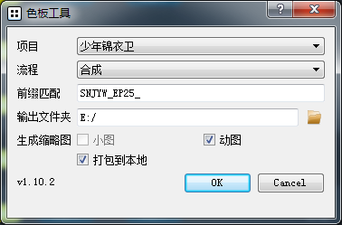

.. _创建色板:

创建色板
===============

为一个文件夹中的图像文件(.jpg, .png, .jpeg)创建html色板

启动
------------

将wlf包加入你python的site-packages之后

使用 ``python -m wlf.csheet -h`` 查看命令行参数

如果不带任何参数调用将会显示图形界面

设置并生成
-----------------

如果使用GUI界面, 需要CGTeamWork支持

:guilabel:`项目` 栏会自动载入当前所有CGTeamWork项目

通过前缀进行过滤出你想要的镜头

如果勾选生成动图, 将会在服务器上利用提交的视频生成动图, 已经被其他人生成过的视频将会自动跳过

打包
**********
默认生成的色板需要连接得上本服务器和本包才能正常查看

如果需要脱离服务器, 使用 :guilabel:`打包到本地`

将会自动下载所有所需资源至 :guilabel:`输出文件夹`

使用
--------------

.. note::

  需要支持ES6的主流浏览器, 如果使用的是低版本IE会提示更新浏览器。

动图
********************

鼠标悬停在缩略图上时如果有动图将会切换成动图显示

如果这一镜头只有视频将固定为动图显示

大图查看
****************

此功能禁用脚本时也能基本使用

点击任意缩略图进入大图查看器

使用 `<` 和 `>` 按钮切换上一张下一张

点击空白处回到缩略图视野

.. tip::

  安装了吾立方Nuke插件后可直接将此处大图拖入Nuke。

刷新
*************

每当缩略图滚入视野会自动刷新

鼠标划过缩略图也会更新

更新最低间隔10秒, 以减少卡顿

