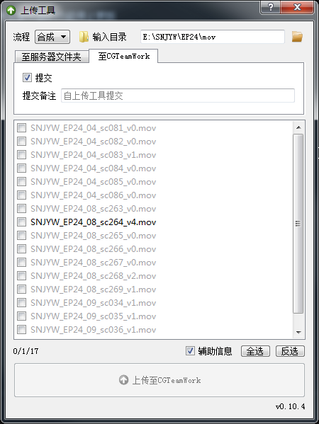

上传工具
===============
上传工作成果至服务器或CGTeamWork

.. tip::

  现在全面使用CGTeamWork, 上传至服务器的功能停止更新

启动
------------
在Nuke和CGTeamWork中都已添加对应菜单

如果要独立启动

在python中使用以下语句

.. code-block:: python

  import wlf.uploader
  wlf.uploader.main()

使用
----------------

1. 将 :guilabel:`流程` 设为上传内容所属流程

2. 将输入目录设为放置要上传的内容所在目录

3. 勾选需上传内容后点击上传

自动版本比较
----------------------

文件框中将只会显示以 `*_v版本` 方式命名文件的最新版本

如果文件和服务器上的文件相同将显示为灰色, 无需也无法上传

辅助功能
--------------------

双击文件框中的文件将直接打开对应文件

如果文件同目录有 `burn-in` 文件夹并且勾选了 :guilabel:`辅助信息`

将打开 `burn-in` 文件夹中的对应文件

文件检查
-------------------

如果不是分配给当前用户的任务或者有其他问题,

条目将会显示为红色, 鼠标悬停可查看具体错误信息。
